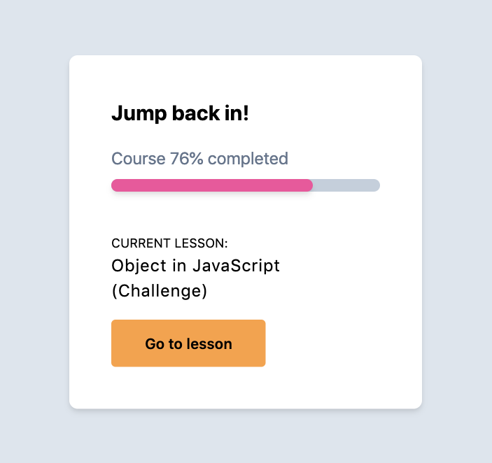

# Tailwind CSS

## Note



```html
<body class="bg-gray-300 flex justify-center items-center h-screen">
  <div class="bg-white p-10 rounded-lg shadow-md">
    <h1 class="text-xl font-bold">Jump back in!</h1>
    <div class="my-4 mb-10">
      <p class="text-gray-600">Course 76% completed</p>
      <div class="w-64 h-3 bg-gray-400 rounded-lg mt-2">
        <div class="bg-pink-500 w-3/4 h-full rounded-lg shadow-md"></div>
      </div>
    </div>
    <h3 class="text-xs uppercase">current lesson:</h3>
    <h2 class="tracking-wider">
      Object in JavaScript <br />
      (Challenge)
    </h2>
    <button class="bg-orange-400 py-3 px-8 mt-4 rounded text-sm font-semibold">
      Go to lesson
    </button>
  </div>
</body>
```
